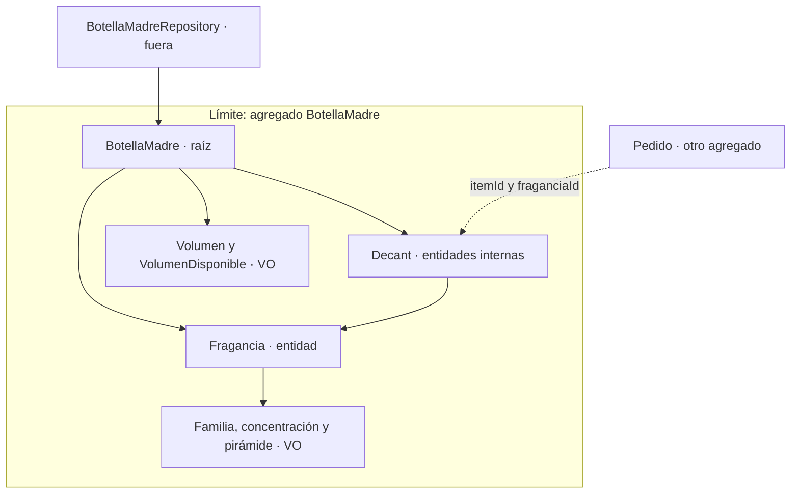
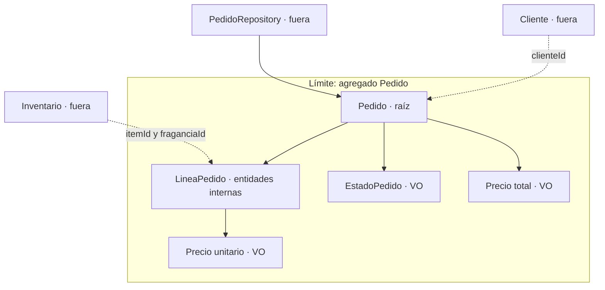

# Agregados y límites de consistencia

## 1. BotellaMadre: inventario y decants

Raíz: **BotellaMadre**. Guarda el volumen original, el disponible, la información de su fragancia y los decants extraídos. Se carga y guarda por BotellaMadreRepository. Decant no tiene repositorio propio: se recupera con `getDecants()` de su raíz. La lista devuelta no permite modificar el agregado.

Invariantes:
1. La identidad, fragancia y volumen original nunca son nulos; el volumen original siempre es positivo.
2. El disponible nunca es negativo ni supera el original; puede ser cero.
3. Un decant siempre tiene volumen positivo y menor que el original.
4. Una extracción nunca supera el disponible y reduce exactamente esa cantidad.
5. Un decant creado por la raíz conserva la fragancia y concentración de la botella y queda en su colección.
6. Un rechazo por datos o stock inválidos nunca cambia inventario ni colección.
7. Una fragancia inactiva nunca permite nuevas extracciones.

Operaciones reales: `crear`, `crearDecant`, `extraerParaDecant`, `getDecants`. La fábrica pública de Decant delega en la raíz; `crearInterno` es de acceso de paquete y se utiliza solo por BotellaMadre.

Fuera del límite: pedidos, clientes, repositorios, DTOs y casos de uso. Pedido conserva identificadores y una foto de descripción/precio; no una referencia mutable a la botella o al decant. Perfume y Tester son presentaciones alternativas; no se agregan a una botella por ser del mismo aroma.

## 2. Pedido: compra e historial

Raíz: **Pedido**. Posee sus LineaPedido, su EstadoPedido y el Precio total. Se carga y guarda por PedidoRepository.

Invariantes:
1. Siempre contiene al menos una línea válida, sin identidades de línea duplicadas.
2. Todas las líneas usan la misma moneda y cantidades positivas.
3. El total siempre se calcula desde precio unitario por cantidad; no se recibe del cliente.
4. Solo pueden agregarse líneas en CREADO; una línea inválida no altera el pedido.
5. Solo permite CREADO → CONFIRMADO → ENVIADO → ENTREGADO, o cancelación desde CREADO/CONFIRMADO.
6. Las líneas y sus precios no se modifican desde la colección devuelta por el getter.
7. Solo un pedido ENTREGADO habilita la creación de una reseña de su comprador.

Fuera del límite: inventario, cliente y reseñas. Resena valida el pedido al crearse y conserva únicamente pedidoId y clienteId. Su almacenamiento y pantalla son ampliaciones, no requisitos de la entrega 1.

## Regla entre agregados: eliminación

LineaPedido conserva `itemId` y **`fraganciaId`**, además de su descripción y precio de compra. No se confunden esos identificadores. El caso de uso consulta si hay pedidos activos de la fragancia, delega la prohibición en `Fragancia.validarEliminacion` y solo elimina las botellas si la regla lo permite. Valida todas antes de borrar ninguna. Cancelados y entregados no son activos y conservan su historial aunque se retire inventario.

La implementación HashMap es para demostración secuencial de entrega 1. Transacciones concurrentes, persistencia duradera y una API HTTP no forman parte de esta entrega.
