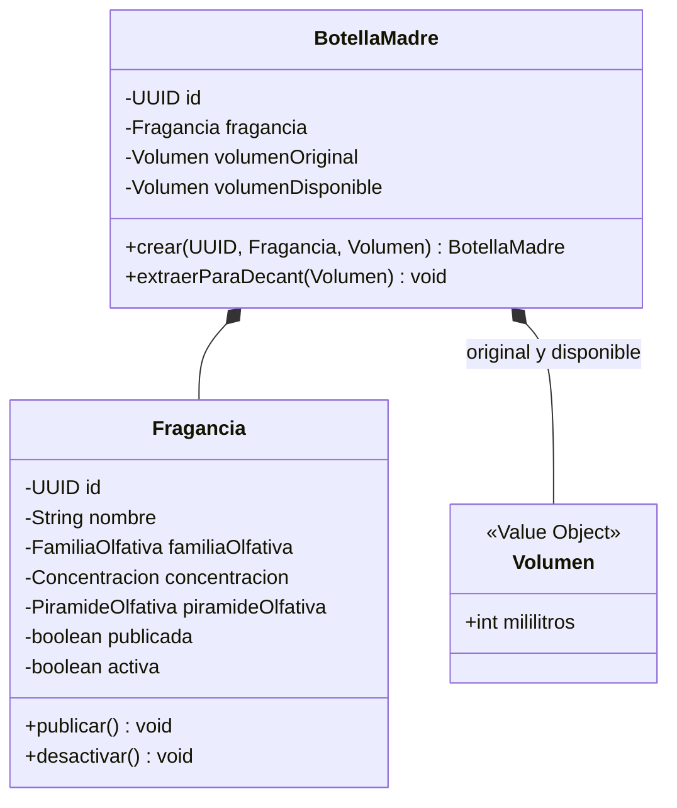

# Agregado Botella Madre

## Invariantes

- Nunca se crea un decant si el volumen solicitado supera el volumen disponible de la botella madre.
- Un decant siempre tiene un volumen positivo y menor que el volumen original de la botella madre.
- Al crear un decant, el volumen disponible de la botella madre siempre se reduce en la cantidad extraída.
- Todo decant conserva la misma fragancia y concentración de su botella madre.
- Una fragancia publicada siempre tiene concentración y una pirámide olfativa válida, con notas de salida, corazón y fondo.
